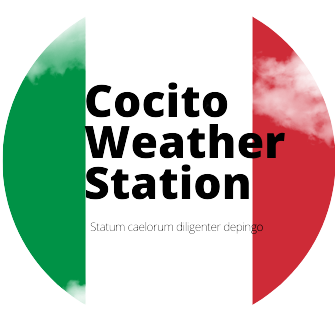

# Profile pictures

|Picture|Title|File|Description|
|---|---|---|---|
||Ukranian Flag|[`ua.png`](ua.png)|Ukrainian flag, default until the war in Ukraine ends (hopefully with the defeat of Russia)|
||Default Picture|[`default.png`](default.png)|Normal default profile picture|
||Rainbow pride flag|[`june.png`](june.png)|In effect for the month june|
||European flag|[`eu.png`](eu.png)|EU day, 9th of May|
||Italian Flag|[`it.png`](it.png)|Italian Republic Day, 2nd of June|
